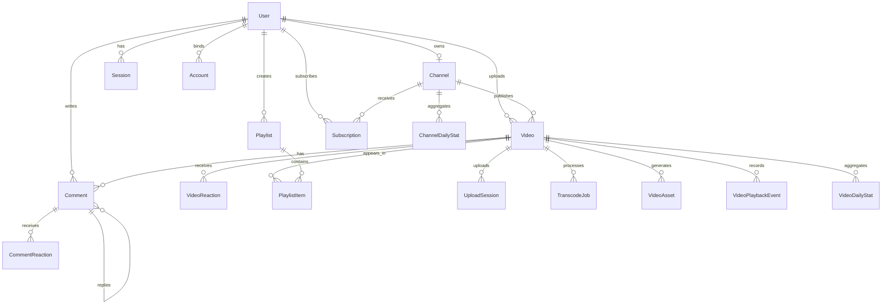

# 3 需求分析

需求分析是系统设计与实现的基础。对于视频点播平台而言，需求不仅体现在页面展示和基础数据增删改查上，还体现在上传、转码、播放、互动、统计等多个业务链路的协同配合。结合本课题“基于 AWS Serverless 架构的视频点播平台设计与实现”的目标，以及项目当前已经形成的页面结构、接口能力与数据库模型，可以将系统需求概括为三类：一是围绕游客与注册用户两类用户形成的使用需求；二是围绕内容浏览、内容生产和平台治理形成的功能需求；三是围绕性能、扩展、可用性和安全性形成的非功能需求。

本章将在上述基础上，对系统角色、功能模块、非功能目标、业务用例以及领域模型进行分析，为后续系统总体设计、数据库设计和实现方案提供依据。

## 3.1 系统角色分析

视频点播平台面向不同使用群体提供差异化能力。结合本系统的实际业务边界，可将平台用户划分为游客和注册用户两类。其中，创作者并不是独立于注册用户之外的单独角色，而是注册用户在执行视频上传、内容管理和数据分析等操作时所体现出的业务身份。因此，本系统在角色分析中以“游客”和“注册用户”作为基本划分，并在注册用户部分补充其作为创作者时的扩展需求。

### 3.1.1 游客

游客是指未登录系统的普通访问者。该类用户无需注册即可进入首页、搜索页、公开视频页和频道页浏览内容，是平台流量入口和内容曝光的主要来源。游客最关注的需求是快速发现内容、稳定播放视频和低门槛了解频道信息，因此系统需要为其提供公开内容浏览、关键词搜索、视频详情查看、在线播放和频道访问等基础能力。

与此同时，游客不具备写操作权限，不能发表评论、进行点赞点踩、订阅频道、保存到收藏夹或稍后再看，也不能进入创作者工作室进行上传和管理操作。对于私有视频、草稿视频以及尚未处理完成的视频，系统应当在权限校验后进行限制访问，以避免未授权资源泄露。

从需求角度看，游客角色强调“低门槛访问”和“公开内容消费”，是平台内容传播能力的直接体现。

### 3.1.2 注册用户和创作者

注册用户是指完成账号注册并成功登录的平台用户。相较于游客，注册用户除了具备公开内容浏览能力外，还拥有完整的互动权限和个人内容组织能力。该类用户可以通过邮箱密码方式登录，也可扩展使用第三方账号登录；登录后，用户能够对视频进行点赞、点踩、评论、回复评论、订阅频道，并将视频加入收藏夹、稍后再看或自定义播放列表。

注册用户还具备更完整的个性化使用场景。例如，系统需要为其保存观看历史，以便后续继续浏览；需要支持其查看已经收藏或稍后再看的内容；需要在播放页中根据登录态展示订阅状态、历史交互状态和个性化操作入口。这类需求决定了系统必须建立稳定的会话管理机制、互动记录机制和用户内容组织机制。

在权限上，注册用户依然不能管理他人内容，不能访问非本人私有资源，也不能操作不属于自己的工作室数据。其核心诉求在于“从被动观看转向主动参与和个性化留存”。

当注册用户进入内容生产场景时，即表现为创作者身份。此时，用户除拥有普通观看者的全部能力外，还需要进入工作室完成视频上传、转码处理跟踪、内容编辑、发布管理、播放列表维护以及统计分析等操作。具体而言，用户需要上传原始视频文件并触发媒体处理流水线；需要查看视频当前处于上传中、处理中、已就绪或处理失败等状态；需要在内容管理界面中编辑视频标题、简介、可见性和发布时间；需要在失败场景下进行任务重试、取消或状态观察；需要通过统计页查看频道层和视频层的观看数据、互动数据和趋势变化。也就是说，创作者并不是另一类用户，而是注册用户在“内容生产”和“运营管理”场景下的功能延伸，这也是本系统区别于单纯视频播放网站的关键所在。

## 3.2 功能需求分析

结合系统角色划分与项目现有模块，平台功能需求可归纳为用户认证、内容浏览、视频播放、频道订阅、播放列表、视频上传处理、内容管理以及统计分析八个方面。各项功能之间并非孤立存在，而是围绕“内容发现、内容消费、内容互动、内容生产、内容运营”形成完整业务闭环。

### 3.2.1 用户注册与登录需求

用户认证模块承担平台身份识别的基础职责。系统需要支持用户完成注册、登录、退出登录和会话保持，并为评论、收藏、播放列表、订阅以及工作室访问等后续业务提供统一的身份前提。考虑到平台既面向普通观看者，也面向会上传视频的注册用户，认证流程既要保证进入门槛较低，也要能够支撑较完整的权限校验。

从功能边界看，系统应支持邮箱密码登录这一基础方式，并为后续接入 GitHub、Google 等第三方登录能力预留扩展空间。登录完成后，服务端需要能够稳定识别当前会话状态，并在页面访问和写操作提交时判断用户是否具备对应权限。对于未登录用户访问评论、收藏、订阅或工作室等受限功能的情况，系统应能够及时拦截并给出登录引导，同时尽量保留原有访问路径，减少认证跳转对使用连续性的影响。

由于系统包含工作室、评论、收藏、订阅等需绑定账号的数据操作，因此认证模块不仅是登录入口，也是整个平台的权限基础设施。

### 3.2.2 首页浏览与搜索需求

首页是用户进入平台后的主要内容发现入口。系统需要提供清晰的视频列表展示能力，使用户能够快速浏览公开内容，并在有限时间内判断是否继续播放。考虑到视频平台内容数量会持续增长，系统还需要提供搜索能力，支持用户根据关键词查找感兴趣的视频内容。

从实际使用场景看，首页不仅要承担内容展示职责，还要帮助用户在较短时间内完成初步筛选。因此，页面需要稳定呈现公开视频列表，并能够区分长视频与短视频等不同内容形态。视频卡片还应展示封面、标题、播放量和发布时间等基础信息，使用户在进入详情页之前就能形成大致判断。

随着平台内容规模扩大，仅依靠首页推荐已经难以满足查找需求，搜索能力也成为不可缺少的组成部分。系统应支持围绕标题等文本字段进行关键词检索，并以列表形式返回结果。无论在首页还是搜索页中，展示范围都应与公开可播放状态保持一致，避免将草稿、私有或尚未处理完成的视频暴露给普通访问者。在内容数量持续增长的前提下，页面还需要具备分页或增量加载能力，以维持浏览效率和交互流畅性。

首页浏览与搜索能力的目标，是帮助用户从大量内容中快速完成“发现”和“筛选”，这也是后续播放、互动和订阅行为发生的前提。

### 3.2.3 视频播放与互动需求

视频播放页是平台最核心的消费场景。用户在进入视频详情页后，不仅需要完成稳定播放，还希望同步获取标题、简介、频道信息、推荐内容和评论区等上下文信息，因此系统需要围绕播放场景构建完整的信息与交互组合。

在播放能力上，系统需要支持基于 HLS 地址进行在线视频播放，并尽量兼顾不同网络环境下的访问稳定性。播放页面除了提供播放器本身，还应同步展示标题、简介、播放量、发布时间和频道信息等上下文内容，使用户能够在观看过程中形成完整的内容认知。

这一场景还伴随着较强的权限和状态判断需求。系统需要结合视频可见性与当前用户身份，区分公开视频、不公开视频、私有视频和草稿视频的访问边界。对于仍处于处理中状态的视频，尤其是创作者本人访问自己的内容时，页面应给出明确的状态提示，而不是简单返回不可访问结果，以减少用户对处理失败或资源丢失的误判。

在互动层面，登录用户应能够完成点赞、点踩、加入收藏夹、加入稍后再看和加入播放列表等操作，并可在评论区中发布评论、回复评论、更新或删除自己的评论，以及对评论进行反应。为了提升连续消费能力，播放页还应展示推荐内容或相关视频列表。与此同时，系统需要记录播放开始、进度变化、暂停、恢复、跳转和结束等行为事件，为后续统计分析和创作者运营提供数据来源。

这一模块连接了内容消费与用户互动，是平台粘性和数据沉淀的关键环节。

### 3.2.4 频道展示与订阅需求

频道页承担创作者品牌展示和内容聚合的作用。用户在浏览视频后，往往需要进一步查看创作者历史作品、频道简介和订阅人数，因此系统需要提供频道维度的聚合展示能力。

从展示内容看，系统应支持为每位注册用户建立唯一频道，并在频道页中呈现名称、头像、横幅、简介和订阅人数等基础信息。这些信息共同构成创作者对外展示的核心形象，也是用户识别内容来源的重要依据。

从浏览逻辑看，频道页还应聚合同一创作者发布的公开视频，便于用户围绕同一内容生产者继续浏览。登录用户在这一页面中应能够完成订阅与取消订阅操作，系统则需要维护订阅关系及订阅人数变化。对于频道拥有者，页面还应保留与本人管理场景相衔接的上下文信息；对于普通访问者，则只展示可公开访问的内容。频道维度的数据沉淀还应能够与后续统计分析模块打通，为创作者持续运营提供基础支撑。

频道模块使平台从“单条视频观看”延伸到“创作者与内容集合”的层面，有助于形成稳定的用户关注关系。

### 3.2.5 收藏夹与播放列表需求

随着平台内容增多，用户需要对感兴趣的视频进行留存和组织。仅依靠观看历史难以满足长期管理需求，因此系统需要提供收藏夹、稍后再看以及自定义播放列表等内容编排能力。

在留存能力上，系统应允许登录用户将视频快速加入收藏夹或稍后再看列表，使用户能够在观看中断或暂时没有时间继续处理内容时保留访问入口。仅有系统默认列表还不足以满足更复杂的使用习惯，因此平台还需要提供自定义播放列表功能，支持用户自行设置标题、简介和公开属性。

围绕播放列表的维护过程，系统应支持添加视频、移除视频和调整顺序等操作，以满足用户个性化组织需求。对于设置为公开的播放列表，系统还应允许其在播放页等场景中展示，从而支持围绕同一主题或同一系列内容进行连续播放。为了保证数据一致性，列表与列表项之间的关系需要被稳定保存，同时避免重复添加和顺序混乱。

这部分功能使平台内容从“被动消费”转向“主动整理”，增强了用户对平台内容的长期沉淀能力。

### 3.2.6 视频上传与处理需求

视频上传与媒体处理是创作者工作链路中最具工程复杂度的部分，也是本课题采用 Serverless 架构的重要原因。系统不仅要接收大文件上传，还要在上传完成后自动触发异步处理流程，最终生成可播放资源并向前端反馈结果。

围绕上传入口，系统需要允许注册用户在工作室中创建视频草稿并获取上传凭证，由客户端将原始视频直接上传至对象存储，从而减轻应用服务器在大文件传输中的带宽压力。上传对象应能够区分长视频与短视频两种内容类型，以便后续展示、管理和统计过程保持一致。

视频文件上传完成后，系统还需要自动创建上传会话记录和转码任务记录，并启动媒体处理工作流。整个媒体处理过程应覆盖元数据提取、视频转码、HLS 切片、封面抽取、结果回写和失败收敛等关键阶段。为了让创作者更容易理解任务进展，系统还应记录任务启动、下载源文件、探测视频信息、转码、上传分片和上传封面等阶段状态，并将这些信息反馈给前端。

当处理成功时，平台应生成可播放的 HLS 主清单和缩略图地址，并同步更新视频可播放状态；当处理失败时，则应保留失败原因，并为后续的人工重试、取消或纠偏操作提供依据。这一需求直接决定了系统在对象存储、工作流编排、任务状态管理和前端状态反馈方面的设计方式。

### 3.2.7 内容管理需求

创作者上传视频后，并不意味着内容即可直接对外提供，平台还需要支持创作者对视频进行持续维护和发布控制。因此，系统需要提供面向工作室的内容管理能力，使创作者可以在统一界面中处理视频生命周期相关事务。

工作室中的内容管理能力应覆盖视频生命周期的主要环节。用户需要能够查看自己上传的全部视频及其当前处理状态，并在统一界面中维护标题、简介、封面、发布时间和可见性等核心信息。为了适应不同发布策略，系统还需要支持草稿、私有、不公开和公开等多种可见性状态，并让这些状态能够准确反映到前台访问控制中。

在内容维护过程中，平台还应支持删除视频或将视频从前台展示中移除，同时保留必要的数据一致性处理能力。对于转码失败、排队异常或处理状态长期未更新的情况，工作室也应提供重试、取消和状态查看等操作入口。除此之外，视频列表、播放列表和单视频详情等内容应尽量集中展示，以便用户在一个工作空间内完成日常发布和运营管理。

内容管理模块的价值在于把“上传”扩展为完整的“发布治理”过程，避免平台只具备前台消费能力而缺乏后台运营能力。

### 3.2.8 数据统计与分析需求

对于创作者而言，仅有视频发布能力是不够的，还需要借助数据了解内容表现和频道增长情况。因此，系统需要围绕播放行为和互动行为构建统计分析模块。

统计分析模块的基础在于行为数据采集。系统需要围绕播放过程记录播放开始、播放进度、暂停、继续、跳转和播放结束等事件，并在此基础上按视频和频道两个层级进行汇总，形成日维度指标。只有完成从原始行为到结构化统计数据的沉淀，后续的运营分析页面才具备可靠的数据来源。

从展示目标看，统计模块应能够呈现观看次数、独立观众、观看时长、点赞增长、评论增长、订阅变化和视频发布数量等核心指标。工作室中的统计页面不仅要支持查看近 30 天频道趋势，还应允许用户下钻到单视频分析页，观察更细粒度的表现变化。若系统能够进一步提供榜单化展示，创作者便可以更直观地识别高表现内容，并据此调整后续运营策略。

数据统计模块将平台从“内容发布系统”进一步提升为“内容运营系统”，使创作者能够基于数据进行后续优化决策。

## 3.3 非功能需求分析

除业务功能外，视频点播平台还需要满足若干非功能目标。由于本系统同时涉及大文件上传、异步媒体处理、在线播放和行为采集，因此性能、扩展性、可用性与安全性对系统建设质量具有决定性影响。

### 3.3.1 性能需求

视频平台对性能的要求主要体现在上传链路、播放链路和查询链路三个方面。

在上传阶段，系统应避免让应用服务器直接承担大视频文件的中转压力，更适合通过预签名上传方式使客户端与对象存储直接交互，以降低带宽占用和传输时延。进入播放阶段后，平台还需要依赖 HLS 主清单与分片资源实现流式访问，从而提升首帧加载速度和播放稳定性。查询链路同样不容忽视，首页、搜索页、频道页和统计页都应在合理时间内返回结果，避免随着数据量增长而出现明显迟滞。

此外，统计采集与评论互动等操作也应具备较好的响应性，不能因后台异步任务而明显影响前端使用体验。

### 3.3.2 可扩展性需求

本系统面向的是具有持续演进可能的视频平台场景，因此必须具备较好的扩展能力。扩展性需求主要包括以下几个方面：

从业务演进角度看，平台后续可能新增推荐、审核、字幕、多清晰度转码和通知等能力，因此当前结构应尽量保持模块独立，避免某一模块的扩展牵动整体重构。从数据建模角度看，用户、视频、频道、播放事件和统计表等核心实体都应具备继续补充字段与关系的空间。媒体处理链路同样需要支持步骤增减、替换和细化，而不必整体推翻既有流程。在部署层面，系统还应能够从本地仿真环境较平滑地迁移到真实云环境。

Serverless 架构、模块化页面组织和关系型数据建模，都是满足这一需求的重要基础。

### 3.3.3 可用性需求

可用性直接影响用户对平台的主观体验。由于视频上传和转码存在天然的异步性，系统需要通过清晰的状态反馈和失败恢复机制保障使用连续性。

平台需要为公开视频提供稳定可访问的播放入口，也需要对上传中、处理中和失败中的视频给出明确状态说明，而不是简单返回错误页或空白结果。对于转码失败、状态卡住或长时间未完成的任务，系统还应支持重试、取消和纠偏等恢复操作，以减少用户在异常场景下的无措感。

除了媒体处理链路之外，评论、收藏和订阅等高频交互也应保持结果可预期，并尽量降低重复提交与状态不同步问题。前台消费页面与后台工作室页面之间的状态口径同样需要统一，避免同一视频在不同位置呈现出相互冲突的信息。可用性需求决定了系统不仅要“能工作”，还要“容易被理解和恢复”。

### 3.3.4 安全性需求

视频平台涉及账号凭证、私有内容、上传权限和内部处理接口，因此安全性是系统建设中的基础要求。

在账号层面，用户身份验证过程需要足够可靠，密码与会话信息也应由统一的认证机制进行管理。围绕内容访问，私有视频、草稿视频和未完成处理的视频都必须进行严格的权限控制，防止未授权用户直接查看。评论、点赞、收藏、播放列表和工作室管理等写操作同样需要绑定当前用户身份，并校验资源归属关系。

上传链路和内部处理链路也具有明显的安全要求。上传凭证应具备明确时效，避免长期暴露可写入对象存储的能力；媒体流水线的内部回调接口则应与外部公开接口区分开来，以降低非法调用风险。除此之外，系统还应保留必要的任务状态、错误信息和操作痕迹，以便在后续运行过程中完成审计、排查和问题追踪。

安全性需求不仅关系到账号与数据保护，也关系到视频平台在开放访问场景下的稳定运行。

## 3.4 系统业务用例分析

在完成角色与需求拆解后，还需要从业务用例角度进一步分析系统行为。通过对关键模块的参与者、触发条件、执行流程和结果进行抽象，可以更清晰地说明系统边界与模块职责。

### 3.4.1 用户认证模块用例

用户认证模块的主要参与者为游客和注册用户。游客在需要执行评论、收藏、订阅、上传等受限操作时触发认证流程；注册用户在会话有效的情况下可直接访问对应能力，并可在需要时进入创作者工作场景。

该模块的典型用例如下：

| 用例名称 | 参与者 | 前置条件 | 基本流程 | 结果 |
| --- | --- | --- | --- | --- |
| 用户注册 | 游客 | 无 | 输入账号信息并提交注册 | 系统创建用户身份 |
| 用户登录 | 游客 | 已存在账号 | 输入邮箱密码或选择第三方登录 | 系统创建会话并建立登录态 |
| 访问受限页面 | 游客 | 未登录 | 访问评论、收藏、工作室等受限能力 | 系统拦截并引导登录 |
| 退出登录 | 注册用户 | 已登录 | 主动执行退出操作 | 系统清除会话并恢复游客身份 |

该模块的核心目标，是为后续所有个性化能力和权限控制提供统一身份基础。

### 3.4.2 视频浏览与播放模块用例

视频浏览与播放模块的参与者包括游客和注册用户。其中，注册用户也可能是视频的拥有者，并在此场景下以创作者身份查看自己的内容状态。无论是否登录，用户都可以浏览公开内容；当访问对象为私有、草稿或处理中视频时，系统需要结合当前身份判断是否允许访问。

其典型用例如下：

| 用例名称 | 参与者 | 前置条件 | 基本流程 | 结果 |
| --- | --- | --- | --- | --- |
| 首页浏览视频 | 游客/注册用户 | 平台存在公开视频 | 打开首页并查看视频列表 | 返回公开视频卡片集合 |
| 搜索视频 | 游客/注册用户 | 输入关键词 | 发起搜索请求 | 返回匹配公开内容 |
| 播放视频 | 游客/注册用户 | 视频具备访问权限 | 打开视频详情页并请求播放地址 | 系统返回可播放页面与播放器资源 |
| 查看推荐内容 | 游客/注册用户 | 已进入播放页 | 浏览推荐视频列表 | 用户可继续跳转消费 |
| 查看处理中提示 | 注册用户 | 视频仍在处理且归属本人 | 打开本人视频页面 | 系统展示处理状态与阶段提示 |

该模块支撑平台最基本的内容消费行为，也是前台用户体验的中心。

### 3.4.3 评论与互动模块用例

评论与互动模块的主要参与者为注册用户，游客只能查看内容，不能执行写操作。该模块围绕视频消费过程中的反馈和社交行为展开。

其主要用例如下：

| 用例名称 | 参与者 | 前置条件 | 基本流程 | 结果 |
| --- | --- | --- | --- | --- |
| 视频点赞/点踩 | 注册用户 | 已登录且视频可访问 | 点击对应互动按钮 | 系统记录反应并更新计数 |
| 发布评论 | 注册用户 | 已登录 | 在评论框输入内容并提交 | 系统创建评论记录 |
| 回复评论 | 注册用户 | 已登录且目标评论存在 | 在评论下发布回复 | 系统建立评论父子关系 |
| 管理评论 | 评论作者 | 已登录且拥有评论归属 | 编辑或删除自己的评论 | 系统更新评论状态 |
| 订阅频道 | 注册用户 | 已登录且非本人重复订阅 | 点击订阅按钮 | 系统建立订阅关系并更新订阅数 |

这一模块使平台具备用户参与感和社区属性，同时也为后续统计分析提供互动维度数据。

### 3.4.4 视频上传与转码模块用例

视频上传与转码模块的主要参与者为注册用户在内容生产场景下的创作者身份，后台执行者则是对象存储、工作流和云函数等系统组件。该模块体现了平台最核心的生产链路。

典型用例如下：

| 用例名称 | 参与者 | 前置条件 | 基本流程 | 结果 |
| --- | --- | --- | --- | --- |
| 创建上传任务 | 注册用户 | 已登录并进入工作室 | 创建视频草稿，获取上传信息 | 系统生成视频记录与上传会话 |
| 上传原始视频 | 注册用户 | 已获取上传凭证 | 客户端直传对象存储 | 原始视频保存到存储桶 |
| 启动转码流水线 | 系统 | 上传完成 | 创建转码任务并启动状态机 | 视频进入处理中状态 |
| 执行媒体处理 | 系统 | 状态机开始运行 | 提取元数据、转码、切片、抽封面、回写结果 | 生成 HLS 与缩略图资源 |
| 失败收敛与重试 | 注册用户/系统 | 任务失败或异常 | 记录错误并支持后续重试或纠偏 | 任务状态收敛，避免长期卡住 |

该模块决定了平台是否能够真正从“文件上传”走到“视频在线播放”。

### 3.4.5 创作者工作室模块用例

创作者工作室模块的参与者本质上仍是注册用户，只是在进入工作室后承担内容生产与管理职责。其作用是将内容生产、内容管理和运营分析集中到统一后台。

主要用例如下：

| 用例名称 | 参与者 | 前置条件 | 基本流程 | 结果 |
| --- | --- | --- | --- | --- |
| 查看内容列表 | 注册用户 | 已登录 | 进入工作室内容页 | 系统返回本人视频列表与状态 |
| 编辑视频信息 | 注册用户 | 视频归属当前用户 | 修改标题、简介、可见性等字段 | 系统保存更新结果 |
| 维护播放列表 | 注册用户 | 已登录 | 创建或更新播放列表，调整项目顺序 | 系统更新列表及条目关系 |
| 查看频道统计 | 注册用户 | 已有频道与统计数据 | 打开统计页 | 系统展示频道趋势、榜单和类型分布 |
| 查看单视频分析 | 注册用户 | 视频存在且归属本人 | 进入单视频分析页 | 系统展示视频观看与互动趋势 |

创作者工作室模块体现了平台的后台治理能力，是支撑创作者持续发布和复盘的重要部分。

## 3.5 领域模型分析

从业务领域角度看，本系统并不是单一的播放器系统，而是由身份认证、内容生产、内容消费、互动关系、媒体处理和统计分析等多个子域共同构成。围绕这些子域，可以将系统核心实体划分为以下几类。

第一类是身份与账号域，包括 `User`、`Session`、`Account`、`Verification` 和 `UserSettings` 等实体。该子域负责描述用户基础信息、登录会话、第三方账号绑定以及个性化设置，是整个平台权限识别和登录态管理的基础。

第二类是创作者与频道域，包括 `Channel` 和 `Subscription`。其中，`Channel` 体现创作者对外展示的内容聚合空间，`Subscription` 则描述用户与频道之间的关注关系。通过这一子域，平台得以从单条视频消费扩展到创作者持续经营。

第三类是视频内容生产域，包括 `Video`、`UploadSession`、`TranscodeJob` 和 `VideoAsset`。`Video` 是系统最核心的内容实体，记录标题、简介、短码、可见性、处理状态、发布时间等信息；`UploadSession` 用于描述原始文件上传过程；`TranscodeJob` 用于追踪媒体处理任务状态、执行阶段和失败原因；`VideoAsset` 用于保存源文件、HLS 主清单、变体资源、缩略图和封面图等具体媒体资产。该子域完整描述了视频从创建、上传、处理到可播放资源生成的生命周期。

第四类是内容消费与互动域，包括 `Comment`、`CommentReaction`、`VideoReaction`、`Playlist`、`PlaylistItem` 和 `VideoPlaybackEvent`。其中，评论及评论反应用于描述围绕视频展开的文本互动；视频反应用于记录点赞和点踩；播放列表及条目用于表达用户对内容的组织和沉淀；播放事件则负责沉淀观看过程中的行为轨迹。该子域支撑了平台的互动性与个性化留存能力。

第五类是统计分析域，包括 `VideoDailyStat` 和 `ChannelDailyStat`。这两个实体分别按视频和频道维度对播放、互动、观看时长和订阅变化等指标进行日级汇总，为工作室统计页和单视频分析页提供数据基础。

从实体关系上看，`User` 既是账号主体，也是频道拥有者和视频上传者，因此一个用户可以拥有一个 `Channel`，并上传多个 `Video`。`Channel` 作为内容聚合空间，可以发布多个视频，也能够通过 `Subscription` 与多个订阅用户建立关联。围绕单个视频，系统既要保存 `VideoAsset`、`UploadSession` 和 `TranscodeJob` 等生产侧信息，也要保存 `Comment`、`VideoReaction`、`PlaylistItem` 和 `VideoPlaybackEvent` 等消费侧信息，由此形成从上传到观看的完整生命周期描述。

评论实体支持父子层级结构，用于实现回复关系；播放列表与视频之间则通过 `PlaylistItem` 建立多对多关联，并借助 `position` 字段表达顺序。统计实体 `VideoDailyStat` 和 `ChannelDailyStat` 处于领域模型的汇总层，用于把原始行为数据转化为可分析的结果，从而连接前台交互与后台运营分析。

为便于理解系统实体之间的整体关系，可将核心领域结构概括为下图所示。

总体来看，本系统的领域模型体现出明显的“账号域驱动内容域、内容域联动互动域、互动域沉淀统计域”的结构特征。该模型既能够支撑前台浏览、播放和互动，又能够覆盖后台上传、处理、管理和分析，为后续系统设计与数据库设计提供了清晰的语义基础。
