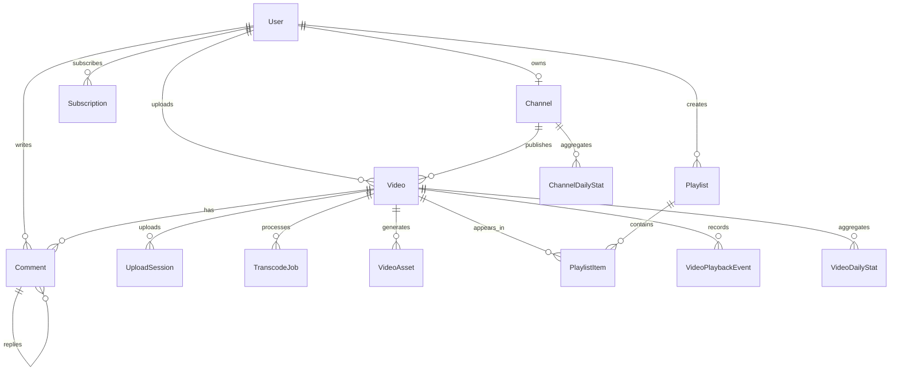

# 3 需求分析

对于视频点播平台而言，需求不仅体现在页面展示和基础数据增删改查上，还体现在上传、转码、播放、互动和统计等多个业务链路的协同配合。结合本课题“基于 AWS Serverless 架构的视频点播平台设计与实现”的目标，以及系统当前已经形成的页面结构、接口能力与数据库模型，可以将需求概括为角色需求、功能需求和非功能需求三个方面。

## 3.1 系统角色分析

### 3.1.1 游客

游客是未登录系统的普通访问者，可浏览首页、搜索页、公开视频页和频道页。其核心需求是快速发现内容并稳定播放视频，因此系统需要提供公开内容浏览、关键词搜索、视频详情查看和频道访问等基础能力。游客不具备评论、订阅、收藏和工作室管理等写操作权限。

### 3.1.2 注册用户

注册用户在游客能力基础上拥有更完整的互动权限和内容组织能力。登录后，用户可以完成点赞、点踩、评论、回复评论、订阅频道，以及加入收藏夹、稍后再看和自定义播放列表等操作。系统需要通过稳定的会话管理和权限校验保证其个性化使用体验。

### 3.1.3 创作者

创作者本质上是进入内容生产场景的注册用户。除普通观看者能力外，创作者还需要在工作室中完成视频上传、处理状态跟踪、内容编辑、发布管理和统计分析等操作。因此，系统必须支持视频生命周期管理、任务状态反馈以及频道和视频数据查看等能力。

## 3.2 功能分析与用例

结合系统角色划分与项目现有模块，平台功能可归纳为用户认证、内容浏览与播放、互动与内容组织、视频上传处理以及工作室管理五个模块。各模块共同构成“内容发现、内容消费、内容生产、内容运营”的完整业务闭环。

### 3.2.1 用户认证模块

用户认证模块负责注册、登录、退出登录和会话保持，并为评论、收藏、订阅及工作室访问等后续操作提供身份基础。系统应支持邮箱密码登录，并预留第三方登录扩展能力。

此处插入图 3-1 用户认证模块用例图。

### 3.2.2 内容浏览与播放模块

该模块承担平台前台消费场景。系统需要支持首页浏览、搜索、视频播放、频道访问和推荐展示，并根据视频可见性和用户身份控制访问范围。对于创作者本人访问处理中视频时，页面还应给出明确状态提示。

此处插入图 3-2 内容浏览与播放模块用例图。

### 3.2.3 互动与内容组织模块

互动与内容组织模块主要面向已登录用户，负责评论、点赞点踩、订阅频道以及收藏夹、稍后再看和播放列表等功能。该模块的目标是增强用户参与度和内容留存能力。

此处插入图 3-3 互动与内容组织模块用例图。

### 3.2.4 视频上传与媒体处理模块

视频上传与媒体处理模块是本系统的核心生产链路。系统需要支持创作者创建视频草稿、获取上传凭证、直传对象存储，并在上传完成后自动触发转码、切片、封面抽取和状态回写等异步处理流程。

此处插入图 3-4 视频上传与媒体处理模块用例图。

### 3.2.5 工作室管理与统计模块

工作室模块面向创作者提供内容管理和数据分析能力。系统需要支持视频信息编辑、可见性维护、任务状态查看、失败任务重试，以及频道和单视频统计结果展示。

此处插入图 3-5 工作室管理与统计模块用例图。

## 3.3 非功能需求分析

### 3.3.1 性能需求

系统应通过预签名上传减轻应用服务器的大文件传输压力，并依靠 HLS 分片提升在线播放稳定性。首页、搜索页、频道页和统计页等查询场景也应保持合理响应时间，以保证整体使用流畅度。

### 3.3.2 可用性需求

系统需要为公开视频提供稳定播放入口，并对上传中、处理中和失败中的视频给出明确状态说明。对于转码失败或状态卡住的任务，平台应支持重试、取消和纠偏等恢复操作，以保证使用连续性。

### 3.3.3 安全性需求

系统应通过统一认证机制管理账号与会话信息，并对私有视频、草稿视频和工作室写操作进行严格权限控制。上传凭证和内部处理接口也应具备时效性和访问限制，避免未授权调用。

## 3.4 领域模型分析

从业务角度看，本系统由账号域、内容域、互动域、媒体处理域和统计域共同构成。`User`、`Channel` 和 `Subscription` 描述账号与频道关系；`Video`、`UploadSession`、`TranscodeJob` 和 `VideoAsset` 描述视频从上传到可播放的生命周期；`Comment`、`VideoReaction`、`Playlist`、`PlaylistItem` 和 `VideoPlaybackEvent` 描述内容消费与互动行为；`VideoDailyStat` 和 `ChannelDailyStat` 用于承接统计分析结果。该领域模型能够支撑平台从内容生产到内容消费再到运营分析的完整链路。

