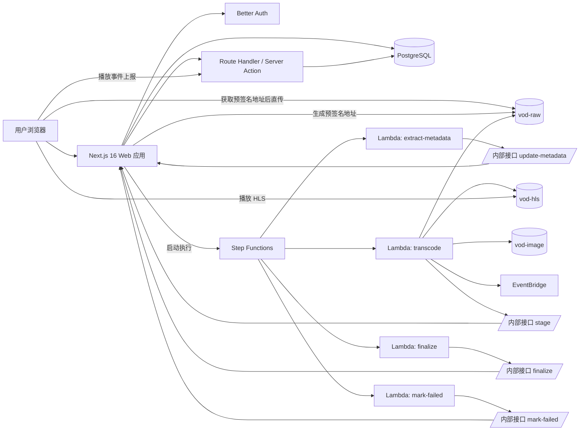
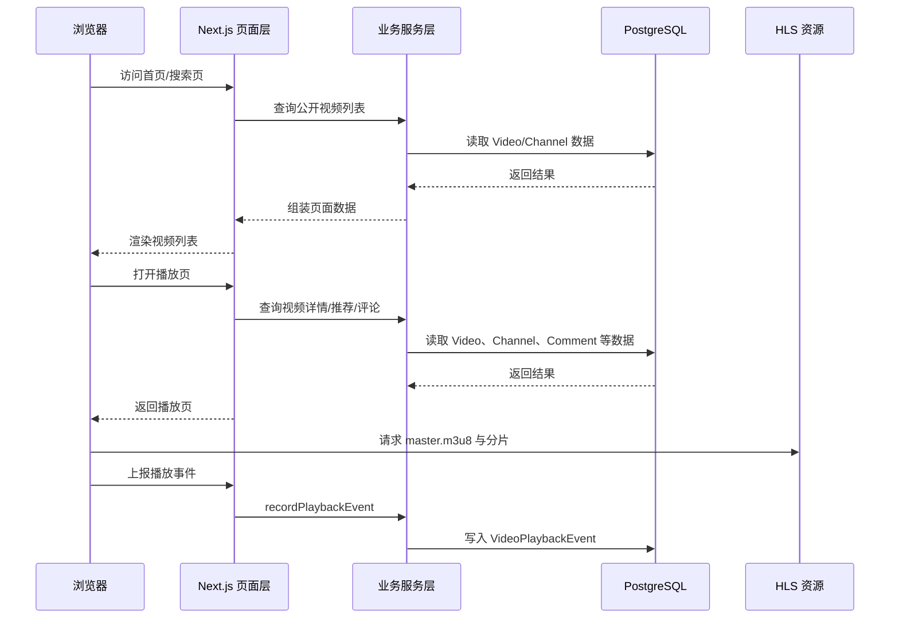
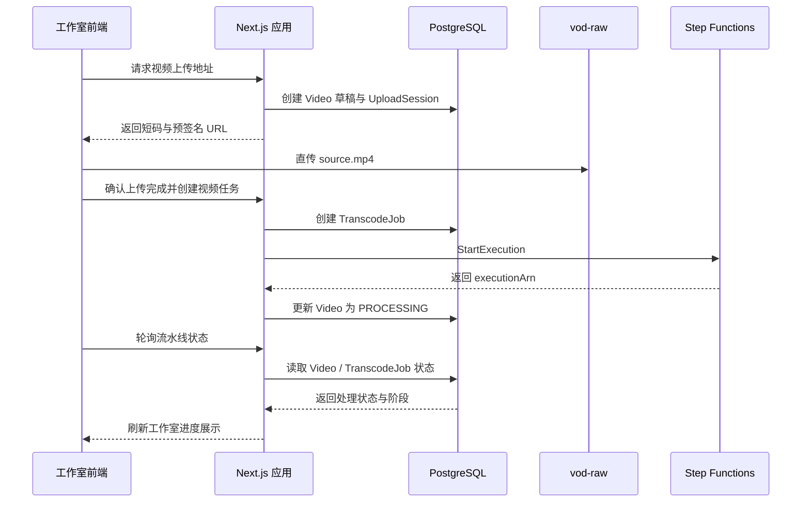
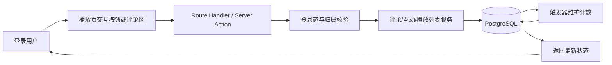
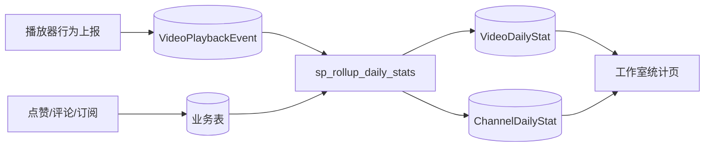
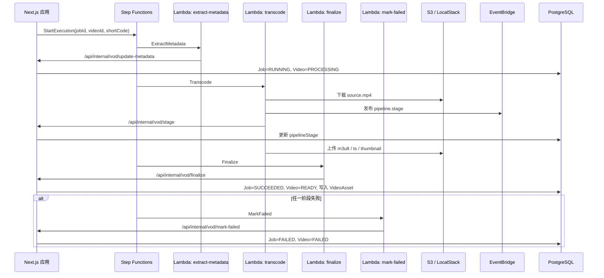
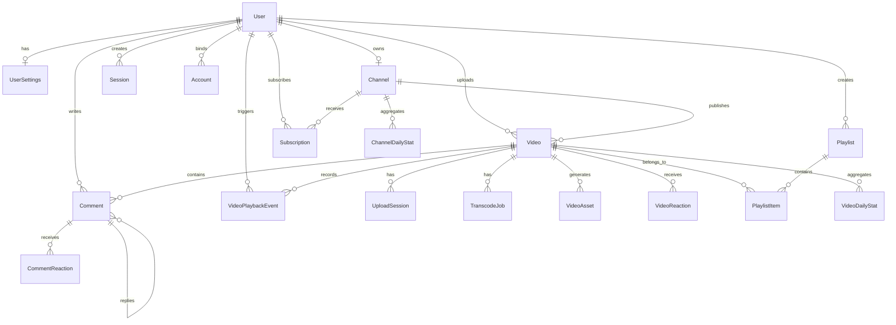
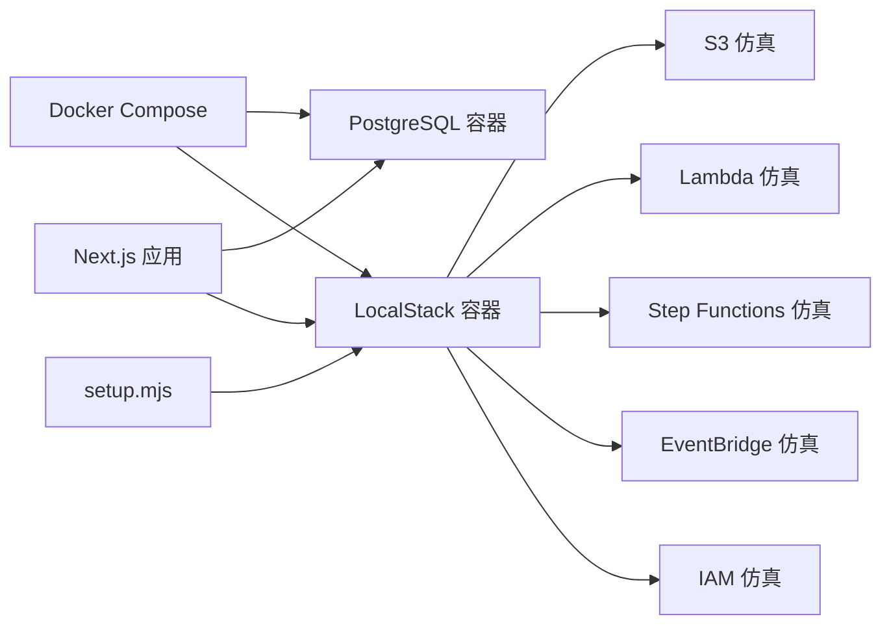

# 4 系统设计

在完成需求分析之后，需要进一步将系统目标转化为可落地的结构方案。视频点播平台与一般信息管理系统相比，既包含账号、内容、评论、播放列表和统计分析等常见业务模块，又包含视频上传、异步转码、HLS 分发和任务状态回写等媒体处理链路。因此，系统设计既要考虑页面组织、服务分层和数据库结构，也要关注媒体流水线的职责拆分、状态一致性和部署方式。

本章围绕系统总体架构、业务流程、功能模块、数据库、接口以及部署与本地仿真环境展开设计说明。相关设计均以项目当前实现为基础，强调前端页面、服务端逻辑、数据库模型与 Serverless 媒体处理流程之间的协同关系。

## 4.1 系统总体架构设计

系统总体架构决定了功能模块之间的关系边界，也决定了后续实现是否具备清晰的扩展路径。结合本项目技术栈与业务特点，平台采用“统一 Web 应用 + 关系数据库 + 对象存储 + 工作流编排 + 云函数处理”的总体模式。这样的组合既保留了 Next.js 全栈工程的开发效率，又能够将大文件上传和异步媒体处理从常规页面请求中解耦出来。

### 4.1.1 系统整体架构

从整体上看，系统由用户浏览器、Next.js 应用层、PostgreSQL 数据层以及基于 LocalStack 仿真的 AWS Serverless 媒体处理层组成。普通页面访问、评论互动、播放列表管理和统计查询等请求主要由 Next.js 应用层处理；结构化业务数据由 PostgreSQL 负责存储，并通过 Prisma 提供类型安全的数据访问能力；视频源文件、HLS 产物和缩略图则分别保存在不同的对象存储桶中；上传后的媒体处理任务由 Step Functions 组织多个 Lambda 阶段执行，并通过内部回调接口把处理结果写回数据库。

系统整体架构如图 4-1 所示。

在这一架构下，系统前台消费链路与后台媒体处理链路可以并行演进。页面层只负责触发上传、发起查询和展示状态，不直接参与大文件转发和长时间转码；媒体处理层则围绕任务状态推进和资源产物生成展开，最终通过数据库状态回写与前端完成协同。

### 4.1.2 前后端分层设计

本系统虽然采用统一仓库开发模式，但内部并不是单层结构，而是按照表现层、交互层、业务服务层、数据访问层和基础设施层进行组织。这样做的目的，是避免页面组件直接耦合数据库和云服务逻辑，从而提高后续维护和扩展的可控性。

表 4-1 给出了系统的前后端分层设计。

| 层次 | 主要职责 | 典型载体 |
| --- | --- | --- |
| 表现层 | 负责页面渲染、组件编排、状态展示和用户交互 | `app/` 下页面、`components/` 下 UI 与业务组件 |
| 交互层 | 负责处理用户提交、组织请求入参和统一输出响应 | `actions/` 下 Server Action、`app/api/` 下 Route Handler |
| 业务服务层 | 负责封装认证、视频、评论、频道、播放列表和统计等核心业务逻辑 | `lib/server/*.ts` |
| 数据访问层 | 负责对象关系映射、事务处理、聚合查询和模型约束 | `lib/prisma.ts`、Prisma Client、`prisma/schema.prisma` |
| 基础设施层 | 负责对象存储、状态机、云函数、事件总线以及本地仿真环境 | `lib/localstack.ts`、`scripts/localstack/`、Docker 与 LocalStack |

表现层主要基于 Next.js `app` 目录组织首页、搜索页、播放页、频道页、登录注册页和工作室页面。对于只读场景，系统更倾向于直接在服务端页面中调用 `lib/server` 下的数据查询函数；对于评论提交、订阅、收藏、播放列表维护和视频管理等写操作，则通过 Route Handler 或 Server Action 进行封装。这样的设计既保留了 Next.js 服务端渲染的优势，也让可写请求拥有统一的校验、鉴权和错误处理入口。

业务服务层承担了系统的核心领域逻辑。例如，`lib/server/videos.ts` 负责公开视频查询、视频详情读取、上传会话创建、转码任务重试与取消、播放事件写入等逻辑；`lib/server/comments.ts` 负责评论列表、回复分页和评论写入；`lib/server/playlists.ts` 负责系统默认播放列表与用户自定义播放列表的维护；`lib/server/stats.ts` 负责频道和单视频的统计分析查询。页面与接口并不直接操作数据库，而是通过这些服务函数完成业务收口。

### 4.1.3 Serverless 媒体处理架构

媒体处理架构是本系统区别于传统内容管理系统的关键部分。为了避免应用服务器直接承担视频转码压力，平台将媒体处理能力独立为对象存储、状态机、云函数和内部回调接口组成的事件驱动流程。原始视频上传至 `vod-raw` 后，由 Step Functions 启动状态机，依次驱动元数据提取、视频转码、结果回写和失败收敛等环节。转码阶段基于 FFmpeg 生成 HLS 主清单与分片文件，并将封面图写入独立图片桶。

系统采用三个对象存储桶分别承载不同资源，设计如表 4-2 所示。

| 存储桶 | 典型路径 | 资源用途 |
| --- | --- | --- |
| `vod-raw` | `{shortCode}/source.mp4` | 保存原始上传视频 |
| `vod-hls` | `{shortCode}/master.m3u8`、`{shortCode}/{variant}/seg_*.ts` | 保存转码后的 HLS 主清单与切片 |
| `vod-image` | `thumbnails/{shortCode}/thumbnail.jpg` | 保存封面图和缩略图 |

媒体处理过程中，Step Functions 状态机采用“ExtractMetadata -> Transcode -> Finalize”的主流程，并在任一环节发生异常时统一进入 `MarkFailed` 支路。转码 Lambda 在关键节点向 EventBridge 发布阶段事件，同时回调内部 `/api/internal/vod/stage` 接口写入数据库中的 `pipelineStage` 字段，以便前端工作室页面展示更可解释的任务进度。通过这一设计，媒体流水线既具备阶段解耦能力，也具备较好的状态可观测性。

## 4.2 系统业务流程设计

系统业务流程设计的重点，不在于简单列举功能顺序，而在于说明页面请求、数据库状态和媒体处理链路之间如何形成闭环。结合本项目实现，平台的核心流程可概括为用户浏览与播放、视频上传与处理、评论互动与收藏、统计采集与展示，以及媒体流水线内部时序五个方面。

### 4.2.1 用户浏览与播放流程

用户浏览与播放流程从首页或搜索页开始。浏览器访问首页时，Next.js 服务端从数据库读取公开视频列表，并将结果渲染为视频卡片。用户点击某条视频后进入播放页，页面通过短码查询视频详情、频道信息、推荐内容和评论区数据，并根据视频可见性、处理状态和当前登录身份决定是否允许访问。

若视频已处于可播放状态，播放器会读取 HLS 主清单地址。在本地开发环境下，播放请求经由 `/api/hls/[...objectKey]` 代理到对象存储；在配置 CDN 域名的情况下，也可以直接经由 CDN 域名访问媒体资源。播放过程中，前端持续向 `/api/videos/[shortCode]/playback-events` 上报播放事件，系统将事件写入 `VideoPlaybackEvent` 表，为后续统计分析提供原始数据。

用户浏览与播放流程如图 4-2 所示。

### 4.2.2 视频上传与处理流程

视频上传与处理流程从工作室中的上传入口开始。注册用户创建视频草稿后，系统生成视频短码、创建频道关联关系，并返回原始视频上传所需的预签名地址。浏览器获得上传地址后，直接将视频文件上传至 `vod-raw` 桶，避免 Web 应用成为大文件传输瓶颈。

文件上传完成后，前端调用创建视频接口，系统据此生成 `UploadSession` 和 `TranscodeJob` 记录，并启动 Step Functions 状态机。状态机驱动 Lambda 完成元数据提取、HLS 转码、封面截取和结果回写，前端则通过状态轮询接口获取当前任务状态与阶段标识。当任务成功结束时，视频状态由 `PROCESSING` 变为 `READY`，播放页可读取 HLS 主清单地址；当任务失败时，系统将错误信息写入数据库，并为工作室中的重试或取消操作保留依据。

视频上传与处理流程如图 4-3 所示。

### 4.2.3 评论互动与收藏流程

评论互动与收藏流程都建立在用户登录状态之上。用户在播放页提交评论时，请求先到达 Route Handler，再由业务服务层完成登录态校验、视频存在性校验和内容合法性校验，最终写入 `Comment` 表。回复评论的过程与之类似，只是在写入时附带 `parentId` 以建立评论层级关系。评论点赞、视频点赞和频道订阅等行为均采用相似的模式：前端发起操作，服务端执行鉴权与资源检查，数据库完成写入，相关计数通过触发器自动维护。

收藏夹、稍后再看以及自定义播放列表的处理也遵循这一思路。系统默认提供“收藏夹”和“稍后再看”两类系统播放列表，用户可以在播放页快速保存视频；若用户需要更强的组织能力，则可在工作室中创建和维护自定义播放列表。列表项通过 `PlaylistItem.position` 字段保持顺序一致性，从而支持连续播放和拖拽排序等交互。

评论互动与收藏流程如图 4-4 所示。

### 4.2.4 统计数据采集与展示流程

统计分析流程由“原始事件采集”和“日级统计展示”两个阶段组成。原始事件采集主要依赖播放器在播放过程中持续上报的行为事件，这些事件被写入 `VideoPlaybackEvent` 表。与此同时，评论、点赞和订阅等互动数据直接写入对应业务表，并由数据库触发器维护累计计数字段。

在统计汇总阶段，数据库通过 `sp_rollup_daily_stats` 存储过程按日期范围聚合 `VideoPlaybackEvent`、`VideoReaction`、`Comment`、`Subscription` 和 `Video` 等数据，生成 `VideoDailyStat` 与 `ChannelDailyStat` 两张日级统计表。工作室中的统计页面读取这些结果，构建频道趋势、视频排行榜、类型分布和单视频明细视图。由于统计查询直接面向日级汇总数据，因此在页面展示时能够避免频繁扫描大量原始事件记录。

统计数据采集与展示流程如图 4-5 所示。

### 4.2.5 媒体处理流水线时序设计

上传流程说明了任务何时开始，而媒体处理流水线时序则关注任务内部如何推进。状态机启动后，`extract-metadata` 负责将任务状态更新为 `RUNNING`、视频状态更新为 `PROCESSING`；`transcode` 负责从原始桶下载视频、执行 FFmpeg 转码、上传 HLS 切片和缩略图，并在关键节点发布阶段事件；`finalize` 负责生成 `VideoAsset` 记录、更新 `Video.thumbnail` 和 `Video.readyAt`；若任一阶段异常，则统一进入 `mark-failed`，完成失败收敛。对于长时间停留在 `QUEUED` 或 `RUNNING` 的任务，系统还提供 `reconcile-stale` 维护接口进行对账与纠偏。

媒体处理流水线时序如图 4-6 所示。

## 4.3 功能模块设计

在总体架构和核心流程明确之后，还需要从模块层面对系统进行拆分说明。本系统以“前台消费 + 后台工作室 + 媒体流水线 + 统计分析”为主要结构，围绕这一结构形成多个职责清晰的功能模块。

### 4.3.1 首页与搜索模块设计

首页与搜索模块承担平台内容发现职责。首页以公开视频为展示对象，通过视频卡片呈现标题、封面、播放量和发布时间等基础信息，并区分长视频与短视频两类内容。为适应内容持续增长的场景，视频列表采用游标式分页和增量加载方式，减少一次性拉取全部数据带来的压力。

搜索模块在数据来源上与首页保持统一，仍然只面向已公开且处理完成的视频进行检索。检索条件主要围绕视频标题、描述和频道名称展开，返回结果按照内容相关性与热度进行组织。这样设计的好处在于，首页与搜索共享同一套内容访问约束，能够避免草稿、私有或尚未完成转码的视频误入公开展示范围。

### 4.3.2 视频播放与推荐模块设计

播放模块由播放器、视频信息区、频道信息区、评论区和推荐区共同构成。播放源优先使用已生成的 HLS 主清单地址，在本地仿真环境下由 HLS 代理接口转发到对象存储，在具备 CDN 域名配置时则可直接切换到外部域名访问。页面在服务端装配视频详情与频道信息时，会同步判断当前用户是否为视频所有者，以及当前视频是否处于公开、私有、草稿或处理中状态。

推荐模块以当前视频为参照，从公开视频集合中选择其他可浏览内容作为侧边推荐列表。若视频处于播放列表上下文中，页面还可以展示对应的播放列表面板，使用户在当前主题内容下继续顺序观看。通过把播放、推荐和播放列表组合到同一页面中，系统能够更好地支撑内容连续消费。

### 4.3.3 评论互动模块设计

评论互动模块围绕“可分页的主评论 + 可递增加载的回复”进行组织。主评论支持按热度和最新时间排序，回复评论则通过父子结构与主评论关联，从而构成层级式讨论区。为了避免前端承担复杂的聚合逻辑，评论列表查询由服务层统一完成，并在返回时附带当前用户的历史反应状态，便于页面直接渲染点赞或点踩按钮状态。

点赞、点踩和评论反应等互动行为采用“接口提交 + 数据表写入 + 触发器维护计数”的模式。这样既保留了交互操作的实时性，也把点赞数、评论数和回复数的维护放回数据库层，减少页面层和服务层手工维护计数字段的负担。

### 4.3.4 频道与订阅模块设计

频道模块将创作者与其公开视频集合绑定为一个统一的内容空间。每个注册用户在首次进入上传场景时，系统会自动为其创建唯一频道，并将视频内容与该频道关联。频道页面不仅展示频道基础信息和公开视频列表，还承担了创作者形象展示与用户关注关系沉淀的作用。

订阅功能围绕 `Subscription` 实体展开。用户在频道页或播放页中均可触发订阅与取消订阅操作，服务端会校验频道归属关系，防止用户订阅自己，并由数据库触发器自动维护频道订阅人数。订阅关系既服务于前台展示，也为后续统计分析中的净增订阅指标提供基础。

### 4.3.5 收藏夹与播放列表模块设计

播放列表模块由系统默认列表和用户自定义列表两部分组成。系统默认提供“稍后再看”和“收藏夹”两类播放列表，便于用户在播放页中一键完成快速保存；自定义播放列表则用于支持更细粒度的内容组织。所有播放列表都归属于当前用户，并通过 `PlaylistItem` 与视频建立多对多关系。

列表项设计中，`position` 字段用于保持播放顺序，系统在添加、删除和重排时都会同步更新位置值，以保证列表顺序一致性。对于公开视频列表，系统支持在播放页中直接展示面板，从而形成“当前视频 + 列表上下文”的顺序消费体验。

### 4.3.6 创作者工作室模块设计

工作室模块是平台后台治理能力的核心承载。该模块包含内容列表、单视频详情、上传对话框、播放列表管理和统计分析入口等多个子界面，用于把创作者在内容生产、内容维护和数据复盘中的操作集中到统一空间。用户进入工作室后，可以查看自己上传的视频列表、搜索视频、编辑视频基础信息、删除视频、切换可见性以及调整封面图。

考虑到媒体处理属于异步任务，工作室并不只展示静态数据，而是同时承担状态追踪职责。内容列表页和单视频详情页都可以读取 `processingStatus`、`pipelineStage` 和 `jobError` 等任务信息；当任务失败时，用户可以通过重试和取消接口发起后续操作。工作室的设计重点不只是“能上传”，而是为创作者提供从上传、处理到发布、分析的完整闭环。

### 4.3.7 视频处理流水线模块设计

视频处理流水线模块由上传会话、转码任务、对象存储资源和状态机编排共同构成。上传会话用于描述原始视频的上传过程，转码任务用于描述上传完成后的异步处理过程，视频资产用于保存最终可播放资源和缩略图信息。通过把这三个对象拆开建模，系统能够分别追踪“文件是否已上传”“任务是否已执行”“产物是否已生成”这三种不同状态。

流水线模块在执行路径上保持清晰的阶段边界。状态机只负责顺序控制和失败捕获，不直接承载业务数据；具体数据变更则由各阶段 Lambda 通过内部回调接口写回应用数据库。这样的设计可以避免 Step Functions 直接访问业务数据库带来的耦合风险，也使媒体处理逻辑保持在相对独立的执行环境中。

### 4.3.8 统计分析模块设计

统计分析模块面向创作者提供频道视图与单视频视图两类入口。频道视图重点展示近 30 天观看次数、观看时长、净增订阅和发布数量等总体指标，并通过折线图、环形图和榜单表反映内容结构与热门视频表现；单视频视图则聚焦于某条视频的观看趋势、独立观众、互动增量和累计摘要，以便创作者从宏观数据进一步下钻到微观内容表现。

在数据来源上，统计页并不直接计算原始事件，而是以 `VideoDailyStat` 和 `ChannelDailyStat` 为主要读取对象。这样既能够控制查询复杂度，也使统计口径在页面之间保持一致。统计模块本质上不是独立的业务系统，而是前台播放行为和后台运营分析之间的桥梁。

### 4.3.9 数据采集与统计分析机制设计

为了使统计模块具备可靠数据来源，系统在设计上采用“实时采集原始事件、离线汇总日级统计”的双层机制。实时层由播放器在观看过程中持续上报播放事件，服务端将其写入 `VideoPlaybackEvent` 表；互动层则由评论、点赞和订阅等业务写操作直接更新业务表，并由数据库触发器维护累计计数。通过这种方式，系统可以同时获得足够细粒度的原始行为记录和即时更新的累计字段。

统计汇总层通过 `sp_rollup_daily_stats` 存储过程把原始事件转换为日级统计结果。该过程按日期范围聚合播放次数、独立观众、观看时长、评论增长、点赞增长和订阅增长，并把结果分别写入视频和频道统计表。相比直接在页面层扫描原始事件表，这一设计更适合长期积累后的数据量，也更符合运营分析场景对统计口径稳定性的要求。

### 4.3.10 异常恢复与任务一致性设计

媒体处理链路天然包含失败风险，因此异常恢复与任务一致性是系统设计中的重点内容。状态机在 `Transcode` 和 `MarkFailed` 等环节配置了重试策略，用于处理临时性错误；`finalize` 在写入 `VideoAsset` 时先删除旧的 `HLS_MASTER` 和 `THUMBNAIL` 记录，再创建新资产，以降低重试场景下的重复写入问题；`cancelVideoJob` 则允许创作者主动终止排队中或执行中的任务，并将任务收敛到 `CANCELED` 或 `FAILED` 状态。

对于更隐蔽的一类异常，即任务停留在 `QUEUED` 或 `RUNNING` 但实际上已经失效的“僵尸任务”，系统提供了内部 `reconcile-stale` 接口进行对账与修正。该接口会识别超出阈值的陈旧任务，并在确认不存在其他活跃任务后将其收敛到失败状态。通过“状态机 Catch 分支 + 任务取消 + 对账纠偏”的组合设计，系统能够在较长运行周期内维持较好的状态一致性。

## 4.4 数据库设计

数据库设计是系统结构设计的基础部分。本系统采用 PostgreSQL 作为核心业务数据库，并使用 Prisma 定义模型、索引、枚举和关系约束。由于平台不仅涉及用户和视频等基础实体，还涉及评论层级、播放列表顺序、媒体任务状态和统计汇总结果，因此数据库设计必须同时兼顾关系完整性、查询效率和后续扩展能力。

### 4.4.1 系统 E-R 图

系统核心实体关系如图 4-7 所示。

从 E-R 图可以看出，`Video` 是平台的中心实体，向前连接上传会话、转码任务和视频资产，向后连接评论、播放列表、播放事件和统计结果。`User` 则是所有业务行为的主体，既可以作为内容消费者，也可以作为内容生产者。这种以用户和视频为双核心的关系结构，与本系统“内容生产和内容消费并存”的业务特点保持一致。

### 4.4.2 核心数据表设计

结合项目当前实现，系统的核心数据表设计如表 4-3 所示。

| 数据表 | 主键 | 关键字段 | 主要作用 |
| --- | --- | --- | --- |
| `User` | `id` | `name`、`email`、`image` | 保存用户基础信息 |
| `Session` | `id` | `token`、`expiresAt`、`userId` | 保存登录会话 |
| `Account` | `id` | `providerId`、`accountId`、`userId` | 保存第三方账号绑定关系 |
| `UserSettings` | `userId` | `theme` | 保存用户个性化设置 |
| `Channel` | `id` | `ownerId`、`name`、`subscribersCount` | 表示创作者频道空间 |
| `Subscription` | `id` | `subscriberId`、`channelId` | 表示用户订阅关系 |
| `Video` | `id` | `shortCode`、`visibility`、`processingStatus`、`readyAt` | 表示视频主实体 |
| `UploadSession` | `id` | `videoId`、`objectKey`、`status`、`expiresAt` | 表示原始视频上传会话 |
| `TranscodeJob` | `id` | `videoId`、`status`、`attempt`、`pipelineStage` | 表示转码任务状态 |
| `VideoAsset` | `id` | `videoId`、`assetType`、`storageBucket`、`storageKey` | 表示转码产物与封面资源 |
| `Comment` | `id` | `videoId`、`parentId`、`content` | 表示评论与回复结构 |
| `VideoReaction` | `(userId, videoId)` | `reactionType` | 表示视频点赞点踩 |
| `CommentReaction` | `(userId, commentId)` | `reactionType` | 表示评论点赞点踩 |
| `Playlist` | `id` | `ownerId`、`title`、`systemKey`、`isPublic` | 表示系统或用户播放列表 |
| `PlaylistItem` | `id` | `playlistId`、`videoId`、`position` | 表示播放列表中的视频条目 |
| `VideoPlaybackEvent` | `id` | `videoId`、`userId`、`eventType`、`watchDeltaMs` | 保存播放器行为事件 |
| `VideoDailyStat` | `id` | `videoId`、`date`、`views`、`watchTimeSeconds` | 保存视频日统计结果 |
| `ChannelDailyStat` | `id` | `channelId`、`date`、`subscribersGained`、`videosPublished` | 保存频道日统计结果 |

其中，`Video`、`UploadSession`、`TranscodeJob` 和 `VideoAsset` 共同描述了视频从创建到可播放的完整生命周期；`Comment`、`Playlist`、`PlaylistItem` 和 `VideoPlaybackEvent` 则构成了内容消费与用户互动链路；`VideoDailyStat` 与 `ChannelDailyStat` 用于承接前台行为数据与后台分析需求之间的转换。

### 4.4.3 数据字典

为了便于说明关键字段的语义，表 4-4 至表 4-6 给出了系统核心数据字典。

表 4-4 账号与内容主表数据字典

| 实体 | 字段 | 类型 | 含义 |
| --- | --- | --- | --- |
| `User` | `id` | String | 用户唯一标识 |
| `User` | `email` | String | 登录邮箱，要求唯一 |
| `Channel` | `ownerId` | String | 频道归属用户 |
| `Channel` | `subscribersCount` | Int | 频道累计订阅数 |
| `Video` | `shortCode` | String | 视频短码，用于播放页路由 |
| `Video` | `visibility` | Enum | 视频访问级别，支持公开、私有、草稿等状态 |
| `Video` | `processingStatus` | Enum | 视频当前处理状态，支持上传中、处理中、已就绪和失败 |
| `Video` | `publishedAt` | DateTime? | 视频对外发布时间 |
| `Video` | `readyAt` | DateTime? | 视频处理完成时间 |
| `Video` | `thumbnail` | String? | 视频封面访问地址 |

表 4-5 媒体处理数据字典

| 实体 | 字段 | 类型 | 含义 |
| --- | --- | --- | --- |
| `UploadSession` | `storageBucket` | String | 原始视频所在存储桶 |
| `UploadSession` | `objectKey` | String | 原始视频对象键 |
| `UploadSession` | `status` | Enum | 上传会话状态 |
| `TranscodeJob` | `status` | Enum | 任务执行状态 |
| `TranscodeJob` | `pipelineStage` | String? | 当前流水线阶段标识 |
| `TranscodeJob` | `attempt` | Int | 当前执行次数 |
| `TranscodeJob` | `maxAttempts` | Int | 最大允许重试次数 |
| `TranscodeJob` | `lastError` | String? | 最近一次失败原因 |
| `VideoAsset` | `assetType` | Enum | 资源类型，如 HLS 主清单、缩略图等 |
| `VideoAsset` | `storageKey` | String | 资源在对象存储中的路径 |

表 4-6 互动与统计数据字典

| 实体 | 字段 | 类型 | 含义 |
| --- | --- | --- | --- |
| `Comment` | `parentId` | String? | 父评论标识，用于回复结构 |
| `Comment` | `repliesCount` | Int | 回复数量 |
| `Playlist` | `systemKey` | Enum? | 系统默认播放列表标识 |
| `PlaylistItem` | `position` | Int | 列表内排序位置 |
| `VideoPlaybackEvent` | `eventType` | Enum | 播放行为类型 |
| `VideoPlaybackEvent` | `watchDeltaMs` | Int? | 单次上报产生的观看时长增量 |
| `VideoDailyStat` | `uniqueViewers` | Int | 当日独立观众数 |
| `VideoDailyStat` | `commentsGained` | Int | 当日新增评论数 |
| `ChannelDailyStat` | `subscribersGained` | Int | 当日新增订阅数 |
| `ChannelDailyStat` | `videosPublished` | Int | 当日发布视频数量 |

除了表结构本身之外，数据库还引入了触发器和存储过程来保证数据一致性。评论数、点赞数和订阅数等累计指标由 `triggers.core.sql` 中的触发器自动维护；日级统计则由 `rollup.daily.sql` 中的 `sp_rollup_daily_stats` 存储过程完成汇总。这意味着数据库不仅承担持久化职责，也承担了一部分计数一致性与统计汇总职责。

## 4.5 接口设计

本系统接口设计采用“统一 JSON 响应格式 + Route Handler 入口 + 业务服务层收口”的方式。对于需要暴露给浏览器的写操作和异步查询，系统通过 `app/api/` 下的 Route Handler 提供 HTTP 接口；对于服务端页面直接读取的数据，则由 `lib/server` 中的服务函数完成。接口工具层通过 `lib/api-route.ts` 统一处理参数校验、错误映射和 JSON 输出，从而降低不同接口之间风格不一致的问题。

### 4.5.1 用户与认证接口设计

用户与认证接口主要围绕登录会话和用户个性化设置展开，如表 4-7 所示。

| 接口 | 方法 | 说明 |
| --- | --- | --- |
| `/api/auth/[...all]` | `GET/POST` | Better Auth 统一认证入口，处理登录、注册、会话等认证相关请求 |
| `/api/settings` | `GET` | 获取当前用户设置，未登录时返回默认设置 |
| `/api/settings` | `PATCH` | 更新用户设置，目前支持主题偏好写入 |

认证接口设计与 Better Auth 的会话机制保持一致，服务端页面和业务服务层都可基于请求头读取当前会话。这样既简化了 Next.js 服务端场景下的登录态获取，也让页面权限控制和接口权限控制共享同一套会话基础。

### 4.5.2 视频内容接口设计

视频内容接口主要服务于首页、搜索、播放页、评论区、订阅和互动操作，如表 4-8 所示。

| 接口 | 方法 | 说明 |
| --- | --- | --- |
| `/api/videos` | `GET` | 获取公开视频列表，支持按类型和游标分页查询 |
| `/api/videos/recommendations` | `GET` | 获取推荐视频列表，可排除当前视频短码 |
| `/api/videos/[shortCode]/comments` | `GET` | 获取视频评论列表，支持排序和游标分页 |
| `/api/videos/[shortCode]/comments` | `POST` | 发布评论 |
| `/api/comments/[commentId]/replies` | `GET/POST` | 查询或新增回复评论 |
| `/api/comments/[commentId]` | `PATCH/DELETE` | 更新或删除评论 |
| `/api/comments/[commentId]/reaction` | `POST` | 对评论执行点赞或点踩 |
| `/api/videos/[shortCode]/reaction` | `POST` | 对视频执行点赞或点踩 |
| `/api/videos/[shortCode]/save` | `POST` | 保存到稍后再看或收藏夹 |
| `/api/channels/[channelId]/subscription` | `POST` | 订阅或取消订阅频道 |

这些接口的共同特点，是都将资源合法性校验和用户身份校验放在服务层中完成。Route Handler 只负责读取参数和映射错误，具体的业务约束，例如视频是否存在、评论是否归当前用户、频道是否允许订阅等，都由 `lib/server` 中的领域服务统一处理。

### 4.5.3 上传与播放接口设计

上传与播放接口既要服务于前端工作室，也要服务于播放器资源读取和状态轮询，因此这一组接口横跨了对象存储、工作室和播放页多个场景，如表 4-9 所示。

| 接口 | 方法 | 说明 |
| --- | --- | --- |
| `/api/uploads/video-url` | `POST` | 获取原始视频预签名上传地址，并创建视频草稿 |
| `/api/uploads/thumbnail-url` | `POST` | 获取封面图预签名上传地址 |
| `/api/videos` | `POST` | 在上传完成后创建转码任务并启动状态机 |
| `/api/studio/videos` | `GET` | 获取当前用户的视频列表，支持工作室内容页查询 |
| `/api/videos/[shortCode]/pipeline-status` | `GET` | 查询视频当前处理状态、任务状态和阶段信息 |
| `/api/studio/videos/processing-statuses` | `GET` | 批量查询多个视频的处理状态，供工作室列表轮询 |
| `/api/studio/videos/for-playlist` | `GET` | 获取可加入播放列表的用户视频集合 |
| `/api/studio/videos/[shortCode]` | `PATCH` | 编辑视频标题、简介、封面和可见性 |
| `/api/studio/videos/[shortCode]` | `DELETE` | 软删除视频 |
| `/api/studio/videos/[shortCode]/retry` | `POST` | 重试失败的视频处理任务 |
| `/api/studio/videos/[shortCode]/cancel` | `POST` | 取消排队中或执行中的转码任务 |
| `/api/studio/playlists` | `GET/POST` | 查询或创建用户播放列表 |
| `/api/studio/playlists/[playlistId]` | `PATCH/DELETE` | 更新或删除指定播放列表 |
| `/api/studio/playlists/[playlistId]/items` | `GET/POST` | 查询或添加播放列表项 |
| `/api/studio/playlists/[playlistId]/items/[itemId]` | `DELETE` | 删除指定播放列表项 |
| `/api/hls/[...objectKey]` | `GET/HEAD` | 代理 HLS 主清单与分片请求到对象存储 |
| `/api/cdn/domains` | `GET` | 返回视频与图片资源的域名配置 |
| `/api/videos/[shortCode]/playback-events` | `POST` | 上报播放器行为事件 |

这一组接口体现了系统“前台消费链路”和“后台生产链路”的交汇点。上传地址生成和播放事件采集都属于普通 Web 请求，但它们连接的分别是对象存储与统计系统；而任务重试、任务取消和状态轮询则使工作室能够与异步媒体流水线保持同步。

### 4.5.4 内部流水线接口设计

内部流水线接口仅供状态机中的 Lambda 阶段调用，不面向普通浏览器开放。这些接口统一要求通过 `Authorization: Bearer <INTERNAL_API_SECRET>` 进行鉴权，以避免内部任务状态回写接口被外部误调用。其设计如表 4-10 所示。

| 接口 | 方法 | 说明 |
| --- | --- | --- |
| `/api/internal/vod/update-metadata` | `POST` | 将转码任务置为 `RUNNING`，视频置为 `PROCESSING` |
| `/api/internal/vod/stage` | `POST` | 写入当前 `pipelineStage` 阶段信息 |
| `/api/internal/vod/finalize` | `POST` | 写入 `VideoAsset`，更新视频为 `READY` |
| `/api/internal/vod/mark-failed` | `POST` | 将任务与视频统一收敛到失败状态 |
| `/api/internal/vod/reconcile-stale` | `POST` | 对账并修正长时间卡住的任务 |

将内部回调设计为应用层接口，而不是让 Lambda 直接写数据库，有两个明显优势。其一，媒体处理链路和业务数据库之间的耦合度更低；其二，数据库写入规则仍然由应用层掌控，从而便于复用已有的状态约束、日志输出和错误处理方式。

### 4.5.5 统计分析接口设计

统计分析模块的读取路径与普通 REST 接口略有不同。本系统没有将频道统计和单视频统计完全暴露为公开 HTTP 接口，而是主要通过服务端页面查询函数直接提供给工作室页面。这些统计接口设计如表 4-11 所示。

| 服务接口 | 使用位置 | 数据来源 | 说明 |
| --- | --- | --- | --- |
| `getDashboardPageData()` | 工作室概览类页面 | `Channel`、`ChannelDailyStat`、`Video` | 返回频道概览、近 7 天趋势、内容结构和最近视频 |
| `getStatPageData()` | 工作室统计页 | `ChannelDailyStat`、`VideoDailyStat`、`Video` | 返回近 30 天频道趋势、订阅流和视频榜单 |
| `getVideoAnalyticsPageData(shortCode)` | 单视频分析页 | `VideoDailyStat`、`Video` | 返回单视频观看趋势、独立观众和互动摘要 |
| `sp_rollup_daily_stats(from, to)` | 统计汇总层 | `VideoPlaybackEvent`、`VideoReaction`、`Comment`、`Subscription` | 将原始行为和互动数据汇总为日级统计结果 |

这种“服务端查询接口 + 数据库汇总过程”的组合方式，适合统计分析场景。一方面，页面无需经过额外的公网 REST 接口即可直接获取统计结果；另一方面，统计计算逻辑被集中在数据库汇总层和服务层中，避免不同页面重复定义统计口径。

## 4.6 系统部署与本地仿真环境设计

系统部署设计不仅影响项目是否能够运行，也关系到媒体流水线在开发阶段的调试成本。考虑到真实 AWS 云资源在日常开发和毕业设计阶段可能带来较高的试错成本，本项目采用 Docker + PostgreSQL + LocalStack 的组合方式构建本地运行环境，在保持对象存储、云函数、状态机和事件总线等链路可验证的同时，降低联调门槛。

### 4.6.1 开发与运行环境设计

系统开发与运行环境如表 4-12 所示。

| 组件 | 选型 | 作用 |
| --- | --- | --- |
| 前端与全栈框架 | Next.js 16 + React 19 | 页面渲染、服务端逻辑和接口处理 |
| 认证 | Better Auth | 登录、会话和第三方认证扩展 |
| 数据库 | PostgreSQL | 持久化业务数据和统计结果 |
| ORM | Prisma | 模型定义、查询封装和类型安全访问 |
| 媒体处理 | FFmpeg / FFprobe | 视频探测、转码、HLS 切片和封面截图 |
| 本地云仿真 | LocalStack | 仿真 S3、Lambda、Step Functions、EventBridge、IAM |
| 容器编排 | Docker Compose | 启动 PostgreSQL 与 LocalStack 容器 |
| 包管理与脚本 | `pnpm`、`bun` | 管理依赖并执行项目脚本 |

在运行方式上，开发者先通过 Docker Compose 启动 PostgreSQL 和 LocalStack，再执行 `localstack:setup` 脚本创建桶、IAM 角色、事件总线、Lambda 函数和状态机，最后启动 Next.js 应用。数据库扩展 SQL 通过 `db:apply-pg-extras` 写入，以补足触发器和统计汇总存储过程。

### 4.6.2 LocalStack 本地云服务仿真设计

LocalStack 在本系统中承担了 AWS 多项服务的本地替代角色，包括对象存储、云函数、工作流编排、事件总线和 IAM。为保证转码 Lambda 能够执行 FFmpeg，本项目还自定义了 `Dockerfile.localstack`，在 LocalStack 镜像中预置静态编译的 `ffmpeg` 和 `ffprobe`，并通过 ready hook 将二进制复制到共享卷，使 Lambda 容器能够直接访问媒体处理工具。

本地仿真环境设计如图 4-8 所示。

LocalStack 的引入使系统在开发阶段就可以验证“直传对象存储、状态机驱动 Lambda、Lambda 回调内部接口、对象存储输出 HLS 资源”这一完整链路。相比只在真实云环境中调试，本地仿真设计更适合频繁修改和验证媒体处理流程。

### 4.6.3 对象存储与媒体处理部署说明

对象存储与媒体处理部分的部署核心，在于统一资源命名规范并保证状态机和 Lambda 部署顺序正确。系统在 `setup.mjs` 中完成以下工作：创建 `vod-raw`、`vod-hls` 和 `vod-image` 三个桶并配置 CORS；为 HLS 和图片桶设置公开读取策略；创建 `lambda-role` 与 `sfn-role` 两个 IAM 角色；创建 `vod-events` 事件总线；随后调用部署脚本完成 Lambda 函数和 Step Functions 状态机的初始化。

为了让播放页和工作室页面能够正确定位媒体资源，平台对资源路径进行了统一约定，如表 4-13 所示。

| 资源类型 | 存储位置 | 说明 |
| --- | --- | --- |
| 原始视频 | `vod-raw/{shortCode}/source.mp4` | 上传源文件，供转码读取 |
| HLS 主清单 | `vod-hls/{shortCode}/master.m3u8` | 播放入口清单文件 |
| HLS 分片 | `vod-hls/{shortCode}/{variant}/seg_*.ts` | 流媒体分段文件 |
| 缩略图 | `vod-image/thumbnails/{shortCode}/thumbnail.jpg` | 播放页和列表页封面图 |

状态机部署完成后，会输出状态机 ARN，并将其写入环境变量供 Next.js 应用在创建转码任务时调用。这样，应用层只需关注“何时启动状态机”和“如何轮询结果”，而不需要感知 Lambda 部署细节。对于开发和测试场景而言，这种部署方式能够在较低复杂度下复现接近真实云环境的媒体处理流程，也为后续迁移到真实 AWS 提供了结构上的连续性。
